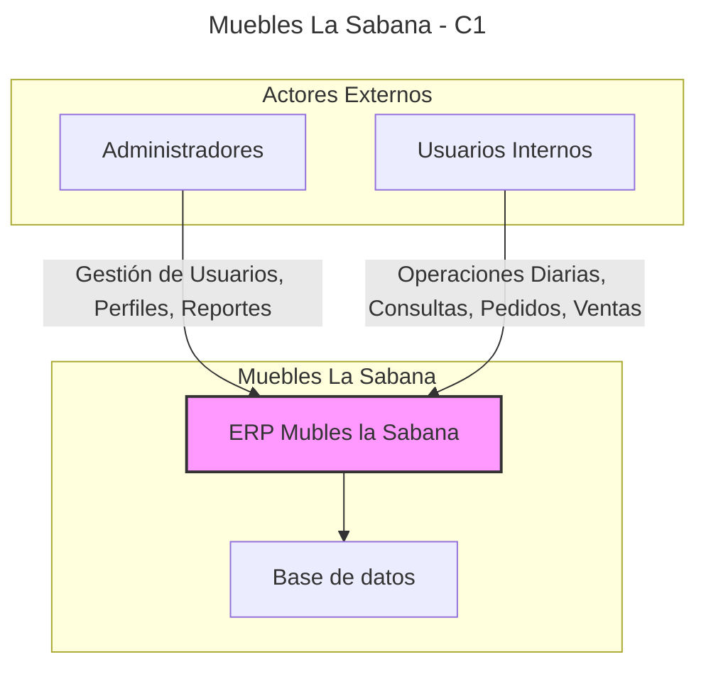

```mermaid
---
title: Muebles La Sabana - C1
---

flowchart TB
%% Actores Externos
    subgraph Actors[Actores Externos]


        C[Administradores]
        D[Usuarios Internos]
    end

%% Sistema Principal
    subgraph Sistema[Muebles La Sabana]
        direction TB

        S1[ERP Muebles la Sabana]

        S3[Base de Datos]

    end

%% Relaciones

    C --> |Gestión de Usuarios, Perfiles, Reportes| S1
    D --> |Operaciones Diarias, Consultas, Pedidos, Ventas| S1


%% Descripción del Sistema
    S1[ERP Mubles la Sabana]:::component --> S3[Base de datos]


    classDef component fill:#f9f,stroke:#333,stroke-width:2px;

```