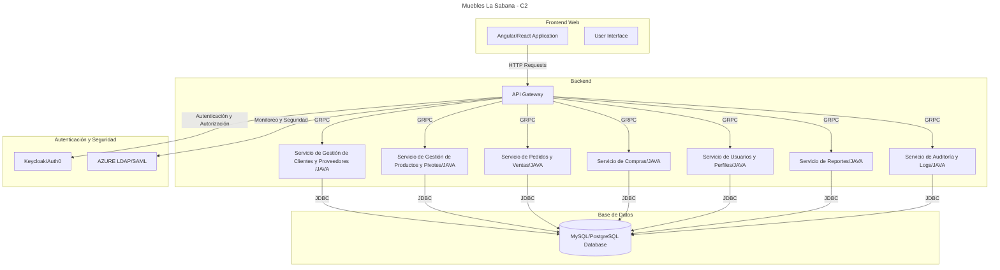

```mermaid

---
title: Muebles La Sabana - C2
---

flowchart TB
%% Contenedores Principales
subgraph Frontend[Frontend Web]
direction TB
FE1[Angular/React Application]
FE2[User Interface]
end

subgraph Backend[Backend]
direction TB
BE1[API Gateway]
BE2[Servicio de Gestión de Clientes y Proveedores /JAVA ]
BE3[Servicio de Gestión de Productos y Pivotes/JAVA ]
BE4[Servicio de Pedidos y Ventas/JAVA ]
BE5[Servicio de Compras/JAVA ]
BE6[Servicio de Usuarios y Perfiles/JAVA ]
BE7[Servicio de Reportes/JAVA ]
BE8[Servicio de Auditoría y Logs/JAVA ]
end

subgraph Database[Base de Datos]
DB1[(MySQL/PostgreSQL Database)]
end

subgraph Auth[Autenticación y Seguridad]
Auth1[Keycloak/Auth0]
Auth2[AZURE LDAP/SAML]

end


%% Relaciones entre Contenedores
FE1 --> |HTTP Requests| BE1
BE1 --> |GRPC|BE2
BE1 --> |GRPC|BE3
BE1 --> |GRPC|BE4
BE1 --> |GRPC|BE5
BE1 --> |GRPC|BE6
BE1 --> |GRPC|BE7
BE1 --> |GRPC|BE8

BE2 --> |JDBC|DB1
BE3 --> |JDBC|DB1
BE4 --> |JDBC|DB1
BE5 --> |JDBC|DB1
BE6 --> |JDBC|DB1
BE7 --> |JDBC|DB1
BE8 --> |JDBC|DB1

BE1 --> |Autenticación y Autorización| Auth1
BE1 --> |Monitoreo y Seguridad| Auth2

```