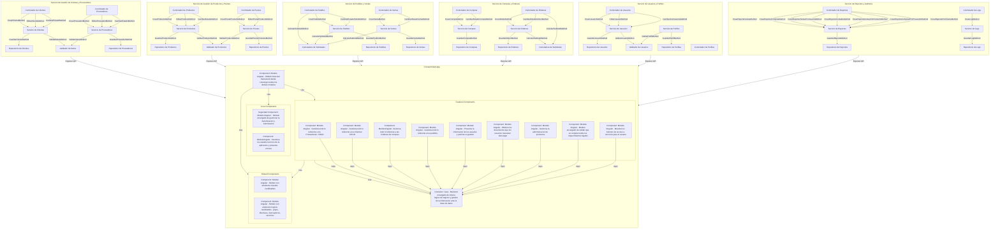

```mermaid
%% Frontend Web
graph TB
%% Definición de contenedores y componentes

    subgraph Frontend[Frontend Web App]
        direction TB
        App[Component: Modulo Angular - Modulo base del framework donde convergen todos los demas modulos]
        
        subgraph CoreComponents[Core Components]
        Seguridad[Seguridad Component: Modulo Angular :  Modulo encargado de gestionar la Autenticacion y Autorizacion]
        Estados[Component: ModuloAngular - Gestiona los estados tecnicos de la aplicacion y presenta errores]
        end
        
        subgraph FeaturesComponents[Features Components]
        Inicio[Component: Modulo Angular - Muestra los botones de acceso a servicios para el usuario]
        Legal[Component: Modulo Angular - Modulo encargado de validar que se cumplan todos los requerimientos legales]
        Productos[Component: Modulo Angular - Gestiona la administracion de productos]
        Reportes[Component: Modulo Angular - Obtiene los documentos que los usuarios necesitan descargar]
        Usuarios[ Component: Modulo Angular - Presenta la informacion de los usuarios y permite su gestion]
        GestionPedidos[Component: Modulo Angular - Gestiona todo lo referente a los pedidos]
        GestionOrdenes[Component: ModuloAngular- Gestiona todo lo referente a las Ordenes de compras]
        GestionClientes[Component: Modulo Angular - Gestiona todo lo referente a los Clientes: CRUD ]
        GestionProveedores[Component: Modulo Angular - Gestiona todo lo referente a los Proveedores  CRUD ]
    end


    subgraph SharedComponents[Shared Components]
        Diseño[Component: Modulo Angular - Modulo con artefactos visuales reutilizables]
        helpers[Component: Modulo Angular - Modulo con artefactos logicos reutilizables  -pipes, directivas, interceptores, servicios-]
    end

    Backend[Container: Java - Backend encargado de toda la logica de negocio y gestion de la informacion ante la base de datos]

%% Definición de relaciones
FeaturesComponents -- "Usa" --> SharedComponents
App -- "Usa" --> CoreComponents
App -- "Usa" --> FeaturesComponents
App -- "Usa" --> SharedComponents
FeaturesComponents -- "Usa" --> Backend

%% Relaciones adicionales entre componentes
Inicio -- "Grpc" --> Backend
Legal -- "Grpc" --> Backend
Productos -- "Grpc" --> Backend
Reportes -- "Grpc" --> Backend
Usuarios -- "Grpc" --> Backend
GestionPedidos -- "Grpc" --> Backend
GestionOrdenes -- "Grpc" --> Backend
GestionClientes -- "Grpc" --> Backend
GestionProveedores -- "Grpc" --> Backend
end

%% Servicio de Gestión de Clientes y Proveedores
subgraph BE2[Servicio de Gestión de Clientes y Proveedores]
direction TB

%% Clases y Componentes del módulo
C1[Controlador de Clientes]
C2[Controlador de Proveedores]
C3[Servicio de Clientes]
C4[Servicio de Proveedores]
C5[Repositorio de Clientes]
C6[Repositorio de Proveedores]
C7[Validador de Datos]

%% Interacciones y Métodos
C1 --> |CrearClienteMethod| C3
C1 --> |EditarClienteMethod| C3
C1 --> |CambiarEstadoMethod| C3

C2 --> |CrearProveedorMethod| C4
C2 --> |EditarProveedorMethod| C4
C2 --> |CambiarEstadoMethod| C4

C3 --> |GuardarClienteMethod| C5
C3 --> |ValidarDatosMethod| C7
C4 --> |GuardarProveedorMethod| C6
C4 --> |ValidarDatosMethod| C7
end

%% Servicio de Gestión de Productos y Pivotes
subgraph BE3[Servicio de Gestión de Productos y Pivotes]
direction TB

%% Clases y Componentes del módulo
P1[Controlador de Productos]
P2[Controlador de Pivotes]
P3[Servicio de Productos]
P4[Servicio de Pivotes]
P5[Repositorio de Productos]
P6[Repositorio de Pivotes]
P7[Validador de Productos]

%% Interacciones y Métodos
P1 --> |CrearProductoMethod| P3
P1 --> |EditarProductoMethod| P3
P1 --> |CambiarEstadoMethod| P3

P2 --> |CrearPivoteProductoMethod| P4
P2 --> |EditarPivoteProductoMethod| P4

P3 --> |GuardarProductoMethod| P5
P3 --> |ValidarProductoMethod| P7
P4 --> |GuardarPivoteProductoMethod| P6
P4 --> |ValidarProductoMethod| P7
end

%% Servicio de Pedidos y Ventas
subgraph BE4[Servicio de Pedidos y Ventas]
direction TB

%% Clases y Componentes del módulo
O1[Controlador de Pedidos]
O2[Controlador de Ventas]
O3[Servicio de Pedidos]
O4[Servicio de Ventas]
O5[Repositorio de Pedidos]
O6[Repositorio de Ventas]
O7[Calculadora de Subtotales]

%% Interacciones y Métodos
O1 --> |CrearPedidoMethod| O3
O1 --> |CambiarEstadoPedidoMethod| O3
O1 --> |CalcularSubtotalMethod| O7

O2 --> |CrearVentaMethod| O4
O2 --> |CambiarEstadoVentaMethod| O4

O3 --> |GuardarPedidoMethod| O5
O4 --> |GuardarVentaMethod| O6
O3 --> |CalcularSubtotalMethod| O7
O4 --> |CalcularSubtotalMethod| O7
end

%% Servicio de Compras y Órdenes
subgraph BE5[Servicio de Compras y Órdenes]
direction TB

%% Clases y Componentes del módulo
Cmp1[Controlador de Compras]
Cmp2[Controlador de Órdenes]
Cmp3[Servicio de Compras]
Cmp4[Servicio de Órdenes]
Cmp5[Repositorio de Compras]
Cmp6[Repositorio de Órdenes]
Cmp7[Calculadora de Subtotales]

%% Interacciones y Métodos
Cmp1 --> |CrearCompraMethod| Cmp3
Cmp1 --> |CambiarEstadoCompraMethod| Cmp3

Cmp2 --> |CrearOrdenMethod| Cmp4
Cmp2 --> |CambiarEstadoOrdenMethod| Cmp4
Cmp2 --> |CalcularSubtotalMethod| Cmp7

Cmp3 --> |GuardarCompraMethod| Cmp5
Cmp4 --> |GuardarOrdenMethod| Cmp6
Cmp4 --> |CalcularSubtotalMethod| Cmp7
end

%% Servicio de Usuarios y Perfiles
subgraph BE6[Servicio de Usuarios y Perfiles]
direction TB

%% Clases y Componentes del módulo
U1[Controlador de Usuarios]
U2[Controlador de Perfiles]
U3[Servicio de Usuarios]
U4[Servicio de Perfiles]
U5[Repositorio de Usuarios]
U6[Repositorio de Perfiles]
U7[Validador de Usuarios]

%% Interacciones y Métodos
U1 --> |CrearUsuarioMethod| U3
U1 --> |EditarUsuarioMethod| U3
U1 --> |CambiarContraseniaMethod| U3


U3 --> |GuardarUsuarioMethod| U5
U3 --> |ValidarUsuarioMethod| U7
U4 --> |GuardarPerfilMethod| U6
U4 --> |ValidarPerfilMethod| U7
end

%% Servicio de Reportes y Auditoría
subgraph BE7[Servicio de Reportes y Auditoría]
direction TB

%% Clases y Componentes del módulo
R1[Controlador de Reportes]
R2[Controlador de Logs]
R3[Servicio de Reportes]
R4[Servicio de Logs]
R5[Repositorio de Reportes]
R6[Repositorio de Logs]

%% Interacciones y Métodos
R1 --> |CrearReporteVentasMethod| R3
R1 --> |CrearReporteComprasMethod| R3
R1 --> |CrearReporteVentasPorUsuarioMethod| R3
R1 --> |CrearReporteContableMethod| R3
R1 --> |CrearReporteVentasPorProductoMethod| R3
R1 --> |CrearReporteComprasPorProveedorMethod| R3
R1 --> |CrearReportePorClienteMethod| R3

R2 --> |CrearLogMethod| R4

R3 --> |GuardarReporteMethod| R5
R4 --> |GuardarLogMethod| R6
end

%% Relación entre Servicios y Frontend
BE2 --> |Exponer API| Frontend
BE3 --> |Exponer API| Frontend
BE4 --> |Exponer API| Frontend
BE5 --> |Exponer API| Frontend
BE6 --> |Exponer API| Frontend
BE7 --> |Exponer API| Frontend

```