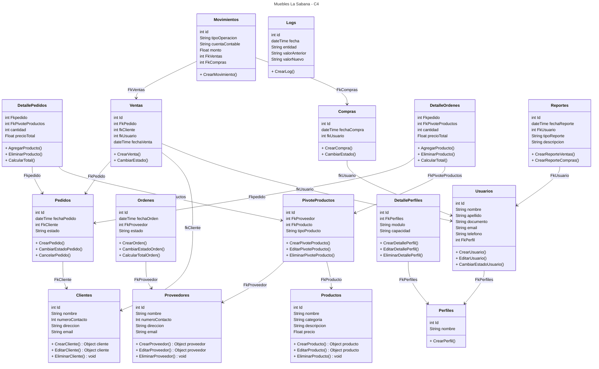

```mermaid
---
title: Muebles La Sabana - C4
---

classDiagram

    class Clientes {

        int Id

        String nombre

        Int numeroContacto

        String direccion

        String email

        + CrearCliente() Object cliente

        + EditarCliente() Object cliente

        + EliminarCliente() void

    }

    class Proveedores {

        int Id

        String nombre

        Int numeroContacto

        String direccion

        String email

        + CrearProveedor() Object proveedor

        + EditarProveedor() Object proveedor

        + EliminarProveedor() void

    }

    class Productos {

        int Id

        String nombre

        String categoria

        String descripcion

        Float precio

        + CrearProducto() Object producto

        + EditarProducto() Object producto

        + EliminarProducto() void

    }

    class Pedidos {

        int Id

        dateTime fechaPedido

        int FkCliente

        String estado

        + CrearPedido()

        + CambiarEstadoPedido()

        + CancelarPedido()

    }

    class DetallePedidos {

        int Fkpedido

        int FkPivoteProductos

        int cantidad

        Float precioTotal

        + AgregarProducto()

        + EliminarProducto()

        + CalcularTotal()

    }

    class Ventas {

        int Id

        int FkPedido

        int fkCliente

        int fkUsuario

        dateTime fechaVenta

        + CrearVenta()

        + CambiarEstado()

    }

    class Compras {

        int Id

        dateTime fechaCompra

        int fkUsuario

        + CrearCompra()

        + CambiarEstado()

    }

    class Ordenes {

        int Id

        dateTime fechaOrden

        int FkProveedor

        String estado

        + CrearOrden()

        + CambiarEstadoOrden()

        + CalcularTotalOrden()

    }

    class DetalleOrdenes {

        int Fkpedido

        int FkPivoteProductos

        int cantidad

        Float precioTotal

        + AgregarProducto()

        + EliminarProducto()

        + CalcularTotal()

    }

    class Movimientos {

        int id

        String tipoOperacion

        String cuentaContable

        Float monto

        int FkVentas

        int FkCompras

        + CrearMovimiento()

    }

    class PivoteProductos {

        int Id

        int FkProveedor

        int FkProducto

        String tipoProducto

        + CrearPivoteProducto()

        + EditarPivoteProducto()

        + EliminarPivoteProducto()

    }

    class Usuarios {

        int Id

        String nombre

        String apellido

        String documento

        String email

        String telefono

        int FkPerfil

        + CrearUsuario()

        + EditarUsuario()

        + CambiarEstadoUsuario()

    }

    class Perfiles {

        int Id

        String nombre

        + CrearPerfil()

    }

    class DetallePerfiles {

        int Id

        int FkPerfiles

        String modulo

        String capacidad

        + CrearDetallePerfil()

        + EditarDetallePerfil()

        + EliminarDetallePerfil()

    }

    class Reportes {

        int Id

        dateTime fechaReporte

        int FkUsuario

        String tipoReporte

        String descripcion

        + CrearReporteVentas()

        + CrearReporteCompras()

    }

    class Logs {

        int id

        dateTime fecha

        String entidad

        String valorAnterior

        String valorNuevo

        + CrearLog()

    }

%% Relaciones basadas en FK

    Pedidos --> Clientes : FkCliente

    DetallePedidos --> Pedidos : Fkpedido

    DetallePedidos --> PivoteProductos : FkPivoteProductos

    Ventas --> Pedidos : FkPedido

    Ventas --> Clientes : fkCliente

    Ventas --> Usuarios : fkUsuario

    Compras --> Usuarios : fkUsuario

    Ordenes --> Proveedores : FkProveedor

    DetalleOrdenes --> Pedidos : Fkpedido

    DetalleOrdenes --> PivoteProductos : FkPivoteProductos

    PivoteProductos --> Proveedores : FkProveedor

    PivoteProductos --> Productos : FkProducto

    DetallePerfiles --> Perfiles : FkPerfiles

    Reportes --> Usuarios : FkUsuario

    Movimientos --> Ventas : FkVentas

    Movimientos --> Compras : FkCompras

    Usuarios --> Perfiles : FkPerfiles


```