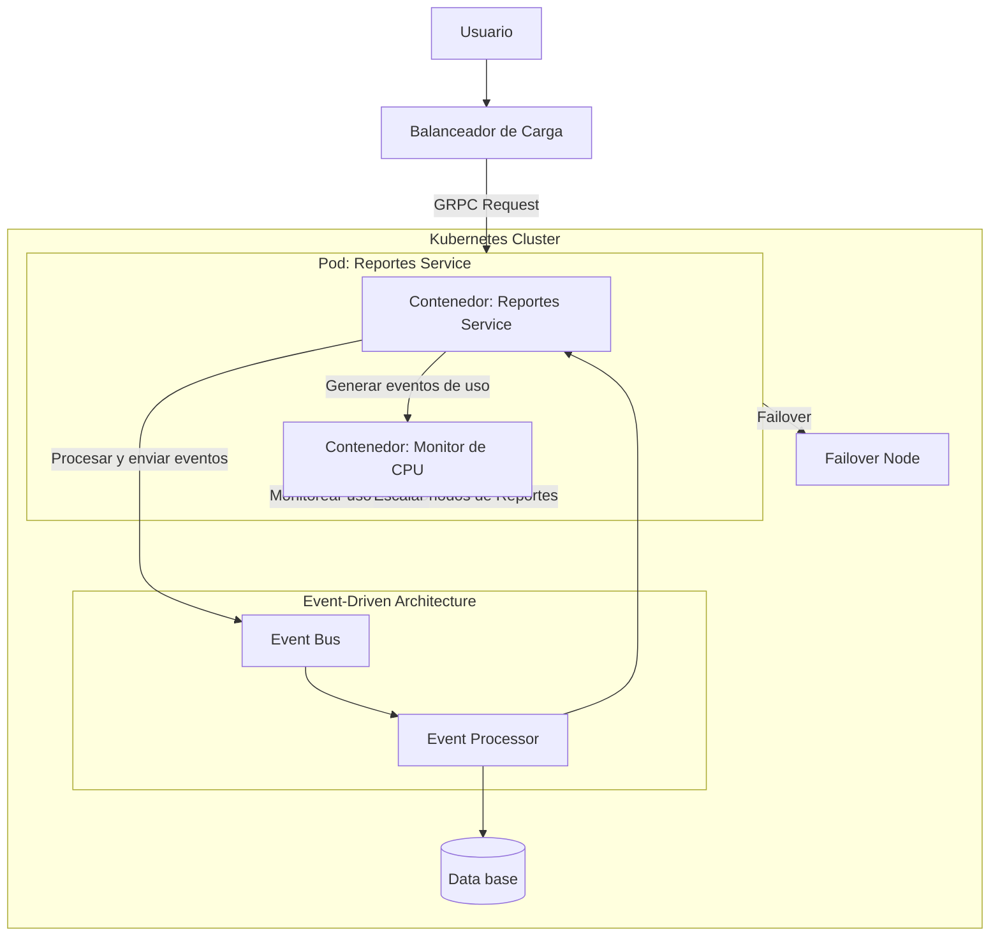

```mermaid
flowchart TD

    %% Usuarios externos que solicitan reportes
    User[Usuario] 

    %% Balanceador de carga
    User --> LB[Balanceador de Carga]

    %% Nodo principal de Kubernetes
    subgraph K8sCluster[Kubernetes Cluster]
        direction RL
        
        %% Pod de Reportes (Escalable)
        subgraph ReportesPod[Pod: Reportes Service]
            direction RL
            ReportesService[Contenedor: Reportes Service]
            Monitor[Contenedor: Monitor de CPU]
        end
        
        %% EDA - Procesador de eventos
        subgraph EDA[Event-Driven Architecture]
            EventBus[Event Bus]
            EventProcessor[Event Processor]
        end
        
        %% Almacenamiento de reportes
        Storage[(Data base)]
        
        %% Nodo de tolerancia a fallos
        Failover[Failover Node]
    end

    %% Relaciones entre componentes
    LB --> |GRPC Request| ReportesPod
    ReportesService --> |Generar eventos de uso| Monitor
    Monitor --> |Monitorear uso de CPU| K8sCluster
    ReportesService --> |Procesar y enviar eventos| EventBus
    EventBus --> EventProcessor
    EventProcessor --> Storage
    EventProcessor --> ReportesService
    ReportesPod --> |Failover| Failover

    %% Escalabilidad automática basada en monitoreo
    Monitor --> |Escalar nodos de Reportes| K8sCluster

```